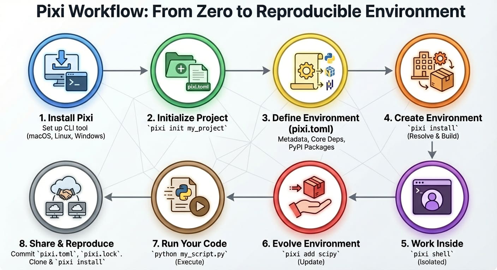

> This tutorial has been "stolen" from [Reproducible Machine Learning Workflows for Scientists](https://carpentries-incubator.github.io/reproducible-ml-workflows/pixi-intro.html) by the Carpentries Incubator.

Reproducibility is a fundamental aspect of scientific research, and managing computational environments is crucial for ensuring that our code can be run by others. One of the best ways to manage dependencies in Python is through the use of virtual environments.

## What is a Virtual Environment?

A virtual environment is a self-contained directory that contains a Python installation and all the packages required for a specific project. It allows us to have different versions of Python and packages for different projects without interfering with each other.

## Package Managers

To create a virtual environment, we can use the `venv` module using [pip](https://en.wikipedia.org/wiki/Pip_(package_manager)) that comes with Python. However, it's an outdated approach. Instead, we will use a dedicated package manager, which provides a modern and efficient way to manage virtual environments, package versions, and dependencies. As with different programming languages, there are several managers just for Python: [Conda](https://en.wikipedia.org/wiki/Conda_(package_manager)), [Mamba](https://github.com/mamba-org/mamba), [Poetry](https://python-poetry.org), and [uv](https://docs.astral.sh/uv/) - just to name a few. For this course, we will use [Pixi](https://pixi.sh/). Here's why.

### Pixi

Pixi, to quote the website, "is a fast, modern, and reproducible package management tool".

-   **Fast**: Building environments and finding compatible package versions is significantly faster than Conda.
-   **Modern**: It is multi-platform, multi-language, memory efficient, and manages complex workflows.
-   **Reproducible**: It keeps track of your package dependencies at both the version and system level, making it easy to reproduce your environment.

Check out this blog post by the creator of Pixi for a comprehensive introduction: [Pixi - reproducible, scientific software workflows!](https://prefix.dev/blog/pixi_for_scientists).

You should have installed Pixi during the setup process ([Setting Up](00_setting-up.qmd)).



Pixi addresses the concept of computational reproducibility by focusing on a set of main features:

-   **Virtual environment management**: Pixi can create environments that contain conda packages and Python packages and use or switch between environments easily.
-   **Package management**: Pixi enables the user to install, update, and remove packages from these environments through the `pixi` command line.
-   **Task management**: Pixi has a task runner system built-in, which allows for tasks with custom logic and dependencies on other tasks to be created.

It also combines these features with robust behaviors:

-   **Automatic lock files**: Any changes to a Pixi workspace that can mutate the environments defined in it will automatically and non-optionally result in the Pixi lock file for the workspace being updated. This ensures that any and every state of a Pixi project is trivially computationally reproducible.
-   **Solving environments for other platforms**: Pixi lets you solve dependencies for platforms other than your current machine. This means collaborators can be confident all environments will work with no additional setup.
-   **Parity of conda and Python packages**: Pixi handles both conda and Python packages seamlessly. It first solves all conda package requirements, locks the environment, then solves Python package dependencies. Pixi checks for overlaps and only installs missing Python dependencies, ensuring full reproducibility without conflicts between the two ecosystems.
-   **Efficient caching**: Pixi uses global caching so packages are downloaded once and reused across projects.

## Project-based workflows

Pixi uses a "project-based" workflow that scopes your project's environments and tools to the project's directory tree.

**Pros**

-   Environments in the workspace are isolated to the project and can not cause conflicts with any tools or projects outside of the project.
-   A high level declarative syntax allows for users to state only what they need, making even complex environments easy to understand and share.
-   Environments can be deleted and rebuilt in seconds without worry of breaking other projects. This gives you freedom to explore and develop without fear.

**Cons**

-   As each project has its own version of its packages installed, and does not share a copy with other projects, the total amount of disk space on a machine can be larger than other forms of development workflows. This can be mitigated for disk limited machines by cleaning environments not in use while keeping their lock files and cleaning the system cache periodically.
-   Each project needs to be set up by itself and does not reuse components of previous projects.

## Pixi project files

Every Pixi project begins with creating a manifest file. A manifest file is a declarative configuration file that lists the high-level requirements of a project. Pixi then takes those requirements and constraints and solves for the full dependency tree.

Let's create our first Pixi project. Use `pixi init` to create a new project directory and initialize a Pixi manifest with your machine's configuration.

``` bash
pixi init gecs-pixi
```

``` output
Created <working-directory>/gecs-pixi/pixi.toml
```

Navigate to the `gecs-pixi` directory and check the directory structure

``` bash
cd gecs-pixi
ls -a
```

``` output
./
../
.gitattributes
.gitignore
pixi.toml
```

We see that Pixi has set up Git configuration files for the project as well as a Pixi manifest `pixi.toml` file. Checking the default manifest file, we see three TOML tables: `workspace`, `tasks`, and `dependencies`.

``` bash
cat pixi.toml
```

or open `pixi.toml` in a text editor to see the contents of the manifest file.

``` toml
[workspace]
authors = ["Your Name <your email from your global Git config>"]
channels = ["conda-forge"]
name = "gecs-pixi"
# This will be whatever your machine's platform is
platforms = ["osx-arm64"]
version = "0.1.0"

[tasks]

[dependencies]
```

The manifest contains three main TOML tables:

-   **\[workspace\]**: Defines metadata and properties for the entire project (name, channels, platforms, version).
-   **\[tasks\]**: Defines tasks for the task runner system to execute from the command line and their dependencies.
-   **\[dependencies\]**: Defines the conda package dependencies from the `channels` in your `workspace` table.

At the moment there are no dependencies defined in the manifest, so let's add Python using the [`pixi add`](https://pixi.sh/latest/reference/cli/pixi/add/).

``` bash
pixi add python
```

``` output
✔ Added python >=3.13.5,<3.14
```

What happened? We saw that `python` got added, and we can see that the `pixi.toml` manifest now contains `python` as a dependency

``` bash
cat pixi.toml
```

``` toml
[workspace]
channels = ["conda-forge"]
name = "gecs-pixi"
# This will be whatever your machine's platform is
platforms = ["osx-arm64"]
version = "0.1.0"

[tasks]

[dependencies]
python = ">=3.13.5,<3.14"
```

Further, we also now see that a `pixi.lock` lock file has been created in the project directory as well as a `.pixi/` directory.

``` bash
ls -a
```

``` output
./
../
.gitattributes
.gitignore
.pixi/
pixi.lock
pixi.toml
```

The `.pixi/` directory contains the installed environments. We can see that at the moment there is just one environment named `default`

``` bash
ls -a .pixi/envs/
```

``` output
default/
```

Inside the `.pixi/envs/default/` directory are all the libraries, header files, and executables that are needed by the environment.

The `pixi.lock` lock file is a YAML file that contains two definition groups: `environments` and `packages`. The `environments` group lists every environment in the workspace for every platform with a complete listing of all packages in the environment. The `packages` group lists a full definition of every package that appears in the `environments` lists, including the package's URL on the conda package index and digests (e.g. sha256, md5).

::: {.callout collapse="true" title="Lock files"}
Here's an example of what the `environments` and `packages` groups look like in the `pixi.toml` file we created for a `linux-64` platform machine.

```         
version: 6
environments:
  default:
    channels:
    - url: https://conda.anaconda.org/conda-forge/
    packages:
      linux-64:

...

      - conda: https://conda.anaconda.org/conda-forge/linux-64/python-3.13.5-hec9711d_102_cp313.conda
      - conda: https://conda.anaconda.org/conda-forge/noarch/python_abi-3.13-8_cp313.conda
      - conda: https://conda.anaconda.org/conda-forge/linux-64/readline-8.2-h8c095d6_2.conda
      - conda: https://conda.anaconda.org/conda-forge/linux-64/tk-8.6.13-noxft_hd72426e_102.conda
      - conda: https://conda.anaconda.org/conda-forge/noarch/tzdata-2025b-h78e105d_0.conda
...

packages:

...

- conda: https://conda.anaconda.org/conda-forge/linux-64/python-3.13.5-hec9711d_102_cp313.conda
  build_number: 102
  sha256: c2cdcc98ea3cbf78240624e4077e164dc9d5588eefb044b4097c3df54d24d504
  md5: 89e07d92cf50743886f41638d58c4328
  depends:
  - __glibc >=2.17,<3.0.a0
  - bzip2 >=1.0.8,<2.0a0
  - ld_impl_linux-64 >=2.36.1
  - libexpat >=2.7.0,<3.0a0
  - libffi >=3.4.6,<3.5.0a0
  - libgcc >=13
  - liblzma >=5.8.1,<6.0a0
  - libmpdec >=4.0.0,<5.0a0
  - libsqlite >=3.50.1,<4.0a0
  - libuuid >=2.38.1,<3.0a0
  - libzlib >=1.3.1,<2.0a0
  - ncurses >=6.5,<7.0a0
  - openssl >=3.5.0,<4.0a0
  - python_abi 3.13.* *_cp313
  - readline >=8.2,<9.0a0
  - tk >=8.6.13,<8.7.0a0
  - tzdata
  license: Python-2.0
  size: 33273132
  timestamp: 1750064035176
  python_site_packages_path: lib/python3.13/site-packages

...
```
:::

These groups provide a full description of every package described in the Pixi workspace and its dependencies and constraints on other packages. This means that for each package specified, that version, and **only** that version, will be downloaded and installed in the future.

We can even test that now by deleting the installed environment fully with [`pixi clean`](https://pixi.sh/latest/reference/cli/pixi/clean/) and then getting it back (bit for bit) in a few seconds with [`pixi install`](https://pixi.sh/latest/reference/cli/pixi/install/).

``` bash
pixi clean
```

``` output
  removed <working-directory>/gecs-pixi/.pixi/envs
```

``` bash
 pixi install
```

``` output
✔ The default environment has been installed.
```

We can also see all the packages that were installed and are now available for us to use with [`pixi list`](https://pixi.sh/latest/reference/cli/pixi/list/)

::: {.callout collapse="true" title="List installed packages"}
``` bash
pixi list
```

``` output
Package           Version    Build               Size       Kind   Source
_libgcc_mutex     0.1       conda_forge         2.5 KiB    conda  https://conda.anaconda.org/conda-forge/
_openmp_mutex     4.5       2_gnu               23.1 KiB   conda  https://conda.anaconda.org/conda-forge/
bzip2             1.0.8     h4bc722e_7          246.9 KiB  conda  https://conda.anaconda.org/conda-forge/
ca-certificates   2025.8.3  hbd8a1cb_0          150.8 KiB  conda  https://conda.anaconda.org/conda-forge/
ld_impl_linux-64  2.44      h1423503_1          660.2 KiB  conda  https://conda.anaconda.org/conda-forge/
libexpat          2.7.1     hecca717_0          73.1 KiB   conda  https://conda.anaconda.org/conda-forge/
libffi            3.4.6     h2dba641_1          56.1 KiB   conda  https://conda.anaconda.org/conda-forge/
libgcc            15.1.0    h767d61c_4          804.8 KiB  conda  https://conda.anaconda.org/conda-forge/
libgcc-ng         15.1.0    h69a702a_4          28.6 KiB   conda  https://conda.anaconda.org/conda-forge/
libgomp           15.1.0    h767d61c_4          436.8 KiB  conda  https://conda.anaconda.org/conda-forge/
liblzma           5.8.1     hb9d3cd8_2          110.2 KiB  conda  https://conda.anaconda.org/conda-forge/
libmpdec          4.0.0     hb9d3cd8_0          89 KiB     conda  https://conda.anaconda.org/conda-forge/
libsqlite         3.50.4    h0c1763c_0          910.7 KiB  conda  https://conda.anaconda.org/conda-forge/
libuuid           2.38.1    h0b41bf4_0          32.8 KiB   conda  https://conda.anaconda.org/conda-forge/
libzlib           1.3.1     hb9d3cd8_2          59.5 KiB   conda  https://conda.anaconda.org/conda-forge/
ncurses           6.5       h2d0b736_3          870.7 KiB  conda  https://conda.anaconda.org/conda-forge/
openssl           3.5.2     h26f9b46_0          3 MiB      conda  https://conda.anaconda.org/conda-forge/
python            3.13.5    hec9711d_102_cp313  31.7 MiB   conda  https://conda.anaconda.org/conda-forge/
python_abi        3.13      8_cp313             6.8 KiB    conda  https://conda.anaconda.org/conda-forge/
readline          8.2       h8c095d6_2          275.9 KiB  conda  https://conda.anaconda.org/conda-forge/
tk                8.6.13    noxft_hd72426e_102  3.1 MiB    conda  https://conda.anaconda.org/conda-forge/
tzdata            2025b     h78e105d_0          120.1 KiB  conda  https://conda.anaconda.org/conda-forge/
```
:::

## Extending the manifest

Let's extend this manifest to add the Python library `numpy` and the Jupyter tools `notebook` and `jupyterlab` as dependencies.

::: {.callout collapse="true" title="Solution"}
Let's start at the command line and add the additional dependencies with `pixi add`

``` bash
pixi add numpy notebook jupyterlab
```

The resulting `pixi.toml` manifest is

``` toml
[workspace]
channels = ["conda-forge"]
name = "gecs-pixi"
platforms = ["osx-arm64"]
version = "0.1.0"

[tasks]

[dependencies]
python = ">=3.13.5,<3.14"
numpy = ">=2.3.2,<3"
notebook = ">=7.4.5,<8"
jupyterlab = ">=4.4.5,<5"
```
:::

Another way to extend the manifest is to add a [task](https://pixi.sh/latest/workspace/advanced_tasks/). Tasks perform commands in the workspace's environments and can depend on other tasks. Let's add a task named `lab` that will launch Jupyter Lab in the current working directory.

We can manually edit the `pixi.toml` with a text editor to add a task named `lab` that when called executes `jupyter lab`. This is sometimes the easiest thing to do, but we can also use the `pixi` CLI.

``` bash
pixi task add lab "jupyter lab" --description "Launch JupyterLab"
```

``` output
✔ Added task `lab`: jupyter lab, description = "Launch JupyterLab"
```

Now the `pixi.toml` manifest has been updated with the new task

``` toml
[workspace]
channels = ["conda-forge"]
name = "gecs-pixi"
platforms = ["osx-arm64"]
version = "0.1.0"

[tasks]
lab = { cmd = "jupyter lab", description = "Launch JupyterLab" }

[dependencies]
python = ">=3.13.5,<3.14"
numpy = ">=2.3.2,<3"
notebook = ">=7.4.5,<8"
jupyterlab = ">=4.4.5,<5"
```

## Task overview

A user can also run `pixi task list` to get a summary of the tasks that are available to them in the workspace.

``` bash
pixi task list
```

``` output
Tasks that can run on this machine:
-----------------------------------
lab, start
Task   Description
lab    Launch JupyterLab
```

Here we used [`pixi run`](https://pixi.sh/latest/reference/cli/pixi/run/) to execute tasks in the workspace's environments without ever explicitly activating the environment. This is a different behavior compared to tools like conda and Python virtual environments, where the assumption is that you have activated an environment before using it. With Pixi we can do the equivalent with [`pixi shell`](https://pixi.sh/latest/reference/cli/pixi/shell/), which starts a subshell in the current working directory with the Pixi environment activated.

``` bash
pixi shell
```

Notice how your shell prompt now has `(gecs-pixi)` (the workspace name) preceding it, signaling to you that you're in the activated environment. You can now directly run commands that use the environment.

``` bash
python
```

``` output
Python 3.13.5 | packaged by conda-forge | (main, Jun 16 2025, 08:27:50) [GCC 13.3.0] on linux
Type "help", "copyright", "credits" or "license" for more information.
>>>
```

As we're in a subshell, to exit the environment and move back to the shell that launched the subshell, just `exit` the shell.

``` bash
exit
```

## Multi-platform projects

So far your project only supports one platform, but we can extend it to additionally support platforms.

Using the [`pixi workspace`](https://pixi.sh/latest/reference/cli/pixi/workspace/), one can add the platforms with

``` bash
pixi workspace platform add linux-64 osx-arm64 win-64
```

``` output
✔ Added linux-64
✔ Added osx-arm64
✔ Added win-64
```

This both adds the platforms to the `workspace` `platforms` list and solves for the platforms and updates the lock file!

::: callout-note
You can also manually edit the `pixi.toml` with a text editor to add the desired platforms to the `platforms` list. In this case you need to run `pixi install` to solve for the new platforms and update the lock file.
:::

The resulting `pixi.toml` manifest looks like this

``` toml
[workspace]
channels = ["conda-forge"]
name = "gecs-pixi"
platforms = ["linux-64", "osx-arm64", "win-64"]
version = "0.1.0"

[tasks.lab]
description = "Launch JupyterLab"
cmd = "jupyter lab"

[tasks.start]
description = "Start exploring the Pixi project"
depends-on = ["lab"]

[dependencies]
python = ">=3.13.5,<3.14"
numpy = ">=2.3.2,<3"
notebook = ">=7.4.5,<8"
jupyterlab = ">=4.4.5,<5"
```

## Global Tools

With the [`pixi global`](https://pixi.sh/dev/reference/cli/pixi/global/), users can manage globally installed tools in a way that makes them available from any directory on their machine.

As an example, we can install the [`bat`](https://github.com/sharkdp/bat) program — a `cat` clone with syntax highlighting and Git integration — as a global utility from conda-forge using [`pixi global`](https://pixi.sh/latest/global_tools/introduction/).

``` bash
pixi global install bat
```

``` output
└── bat: 0.25.0 (installed)
    └─ exposes: bat
```

Pixi has now installed `bat` for us in a custom environment under `~/.pixi/envs/bat/` and then exposed the `bat` command globally by placing `bat` on our shell's `PATH` at `~/.pixi/bin/bat`. This now means that for any new terminal shell we open, `bat` will be available to use.

Using `pixi global` has also created a `~/.pixi/manifests/pixi-global.toml` file that tracks all of the software that is globally installed by Pixi

``` toml
version = 1

[envs.bat]
channels = ["conda-forge"]
dependencies = { bat = "*" }
exposed = { bat = "bat" }
```

As new software is added to the system with `pixi global` this global manifest is updated. If the global manifest is updated manually, the next time `pixi global update` is run, the environments defined in the global manifest will be installed on the system. This means that by sharing a Pixi global manifest, a new machine can be provisioned with an entire suite of command line tools in seconds.

If you want to delete a globally installed environment, you can use `pixi global uninstall` to remove the tool from the system and update the global manifest.

``` bash
pixi global uninstall bat
```

::: callout-note
In this case we could have used `pixi global remove bat` as well since there is only one version of `bat` installed. Difference between `remove` and `uninstall` is that `remove` can be used to remove a specific version of a tool if there are multiple versions installed, while `uninstall` will remove environment with that name.
:::

## Version controlling the project

Now, we can version control our project with Git and share it on GitHub. Use terminal to add the `pixi.toml` and `pixi.lock` files to Git and commit them to your local repository. Alternatively, you can use or VS Source Control tab to do the same thing automatically and publish the repository on GitHub in one go.

For local Git commit, use the following commands in the terminal:

``` bash
git init
git add pixi.* .git*
git commit -m "first commit"
```

## The Book Project

Throughout this tutorial, we've built a Pixi project from scratch. If you'd like to see a complete, working example of everything we've covered, you can access the finished project on GitHub at <https://github.com/igorsdub/gecs-venv>.

To use this example project on your machine:

``` bash
cd ~
git clone https://github.com/igorsdub/gecs-venv.git
cd gecs-venv
```

Then follow the instructions in the `README.md` file to set up the project.