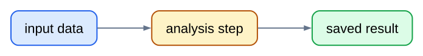
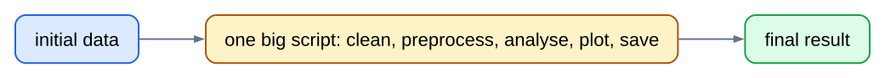
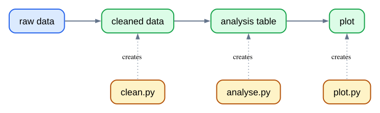
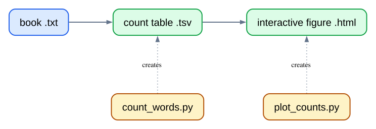
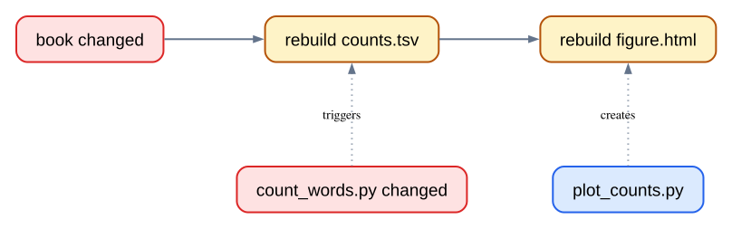
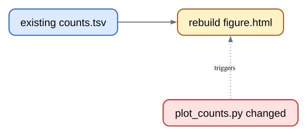

## Automation makes analysis repeatable

We want a workflow that we can run again:

::: {.incremental}
- for a new input file;
- after changing the code; and
- without remembering every command by hand.
:::

::: {.diagram-large}

:::

## One giant script hides the workflow

::: {.diagram-large}

:::

::: {.incremental}
- Intermediate results disappear.
- Failures are harder to locate.
- Changing one step means reading a large program.
:::

## Save the steps that matter

Split work into small scripts and files that can be checked independently.

::: {.diagram-large}

:::

Each output is a checkpoint: inspect it, test it, or reuse it.

## Modular workflows leave two questions

1. **New data arrives.** How do we run the same workflow for the new file?

2. **Code changes.** Must we rerun everything, or only the affected part?

## Make records the plan

```makefile
# Makefile: a small description of the workflow
output-file: input-file script
	command input-file output-file
```

Make reads rules like this to learn:

- which file to create;
- which files it depends on; and
- which command creates it.

## Our book workflow

`gecs-make` turns books into count tables and interactive figures.

::: {.diagram-large}

:::

## First output: Dracula's count table

```makefile
counts/dracula.tsv: books/dracula.txt scripts/count_words.py
	uv run python scripts/count_words.py books/dracula.txt counts/dracula.tsv
```

::: columns
:::: column
### Target

The file to create.
::::

:::: column
### Prerequisites

The input data and code it needs.
::::

:::: column
### Recipe

The tab-indented command that creates the target.
::::
:::

## Add the final figure

```makefile
figures/dracula.html: counts/dracula.tsv scripts/plot_counts.py
	uv run python scripts/plot_counts.py counts/dracula.tsv figures/dracula.html
```

```bash
make figures/dracula.html
```

Make builds `counts/dracula.tsv` first when needed, then makes the HTML figure.

## Dracula's real project graph

The graph comes from the project’s Make rules, not from a hand-drawn diagram.

{fig-alt="A generated directed acyclic graph that shows Dracula flowing from its book text file through a count table to an HTML figure. Gold script nodes provide the count and plot steps."}

## A changed book or counting script rebuilds downstream work

::: {.diagram-large}

:::

The count table is no longer trustworthy, so Make rebuilds it and every output that depends on it.

## A changed plotting script starts later

::: {.diagram-large}

:::

The count table stays current. Only the figure needs to be made again.

## Name shared commands

```makefile
# Run every Python command through uv.
PYTHON := uv run python

# Name the scripts used by our rules.
COUNT_SCRIPT := scripts/count_words.py
PLOT_SCRIPT := scripts/plot_counts.py
```

Variables make the Dracula rule shorter and keep shared details in one place.

## Discover every book without listing it by hand

```makefile
# Find every text file already in books/.
BOOK_FILES := $(wildcard books/*.txt)
```

```text
$ make print-books
books/dracula.txt
books/frankenstein.txt
books/moby_dick.txt
books/sherlock_holmes.txt
…
```

`wildcard` reads the book files that really exist. Add another `.txt` file and it joins the workflow.

## Derive matching paths with `patsubst`

```makefile
# Pattern substitution: replace books/%.txt with counts/%.tsv.
COUNT_FILES := $(patsubst books/%.txt,counts/%.tsv,$(BOOK_FILES))

# The same book names become figure paths.
FIGURE_FILES := $(patsubst books/%.txt,figures/%.html,$(BOOK_FILES))
```

`patsubst` means **pattern substitution**. `%` matches the changing book name, then inserts it into the new path.

## One rule shape works for every book

```makefile
# Turn any book text file into its matching count table.
counts/%.tsv: books/%.txt $(COUNT_SCRIPT)
	$(PYTHON) $(COUNT_SCRIPT) $< $@

# Turn any count table into its matching HTML figure.
figures/%.html: counts/%.tsv $(PLOT_SCRIPT)
	$(PYTHON) $(PLOT_SCRIPT) $< $@
```

- `$<` is the input; `$@` is the output being built.
- The `%` in each rule keeps the matching book name.

## The project workflow in full

The same rules describe every book and every dependency in the project.

{fig-alt="A generated directed acyclic graph showing four books, count tables, figures, and gold script nodes."}

## Why use Make

::: {.incremental}
- **Automated order:** no need to remember the steps.
- **Reproducibility:** someone else can run the same project command.
- **Modularity:** scripts and intermediate outputs stay understandable.
- **Selective rebuilding:** timestamps identify what must run again.
:::
